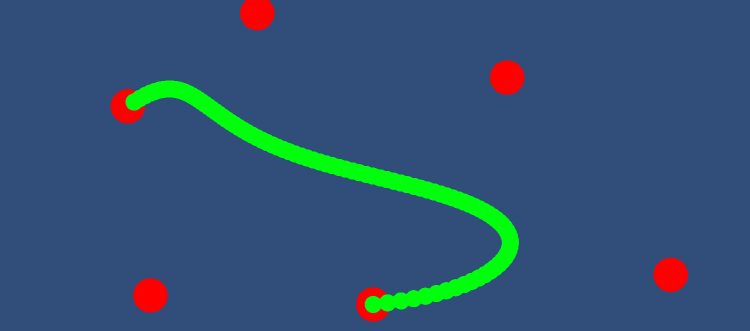
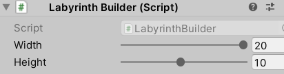
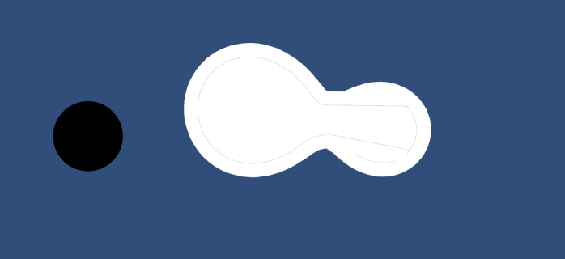

# LIST OF EXERCISES

 _Author : Samuel "Chaussur**r**e" Corno_

 A list of little exercises to both show what I can do on Unity, and train a bit.

### Installation

 Clone the repository on your computer, and open the repository in Unity. You cannot view the exercises without Unity.

### Version

    Unity 2021.2.0a15

### Overview

 Every Exercise is in its own folder and has its own _Assets_ folder. To view an exercise, just run the Scene at the base of the folder.

## Bézier Curves

 _folder : BeziezCurve_

### Description

 A bézier curve is a smooth curve that go from point to another, and whose curvature is influenced by any number of control points, and that can be scaled indefinitely.

### Implementation

 The implementation used is a simple use of recursive linear interpolations. This implementation is both easy to implement, and works on any number of control points.

 Lets say we have N points, and we want to know the coordinates of the point k, with 0 <= k <= 1 (We use real numbers to refer to points of the curve).
 We first compute the linear interpolation of the point k1 between point 1 and 2, then k2 between points 2 and 3, etc.
 We then get a list of points (_k1, k2, k3 ... kn-1_). We repeat this step on the new list of points until we get only one point. The final point is the exact coordinates of the point k;

### On Unity

 When you run this exercise, you will get a view similar to this :

 

 The curve goes from one point to another. The others points are control points.
 You drag any points anywhere on the screen during play mode, and watch the curve adapt.
 On edit mode, you can simply add nodes or remove them from the scene to add or remove control points. However, all nodes must be children of the object _"curve"_.

## Maze generation

 _folder : Labyrinth_

### Description

 The goal of this exercise is to create a perfect maze and to solve it. A perfect maze is a maze with no loops (and as such can be interpreted as a tree).

### Implementation

 The used algorithme start with a maze where all walls are built and we "color" every cell in the same color (note: cells colors are not represented in the scene, they are only an algorithmic concept in this exercise)
 Then, we break a random wall and color all the nodes "linked" this way the same color. We repeat this step until the whole maze is of the same color.
 To make sure the result maze is perfect, we cannot break walls between cells of the same color.

 For solving the maze, as the maze is similar to a non-weighted graph, we use a simple breadth-first traversal. A depth-first traversal is also available, since there is no loop in this maze. Had the maze been non perfect, this latter approach wouldn't have been possible

### On Unity

 On edit mode, you can modify the object _"Labyrinth"_ to specify how the builder and the solver should behave :

 - You can modify the height and width of the maze in the component _"Labyrinth Builder"_ (although a maze too big will not be entirely displayed in the screen)
 
 

 - You can modify how much time is spent on each building step or solving step, by modifying the _"Time Per Step"_ field in respectively the _"Labyrinth Builder View"_ and the _"Labyrinth Solver View"_ components.

 

 - You can choose between a breadth first approach or a depth first approach to solving the maze in the _"Labyrinth Solver View"_

 Once you specified all the wanted parameters, simply run the scene and enjoy the show :)

## MetaBalls

 _folder : MetaBalls_

### Description
 
 A metaball is a sphere (in this exercises, we use circles, but the principles stay the same) that merges with any other nearby metaballs. 
 Some metaballs can be negatives, causing nearby metaballs to curve away from them.

### Implementation

 We first decide on an arbitrery real positive threshold. 
 Then, for each metaballs in the scene, we compute a number of points P. 
 Each point is the result of an unit vector v, at an angle, and multiplied by a scalar k.
 The scalar k is first set to a low value, then we compute the global metaball value of the vector (v * k). If the value is lower than the threshold, we increase it until it is higher.
 
 The global metaball value of a vector is the sum of the mass of each metaball divided by the distance between the center of the metaball and the vector.

 Once every points of P is computed, we set the perimeter of the metaball to be the list of points P.

### On Unity

 The threshold value can be changed in the object _"MetaBallManager"_.
 The number of points can be changed on each metaball. A large number of points means a smoother metaball, but higher computation cost.
 You can change the mass of any metaball, and can even set it to negative values. Negative metaballs are represented in black.

 Once you run the simulation, you can drag and drop the metaballs around the scene and see them evolve.

 

 _Two metaballs merging (in white) and a negative metaball (in black)_